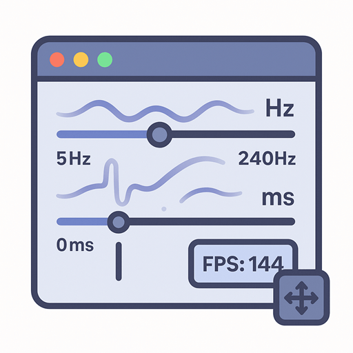

<div align="center">
  
  
  # 🎮 刷新率体验项目
  
  一个基于 Vue 3 + Vite 的交互式刷新率体验应用<br/>
  让用户通过拖动虚拟窗口来直观感受不同刷新率和延迟的区别
  
  [](https://github.com/MaskerPRC/refresh-rate-expericence/stargazers)
  [](https://github.com/MaskerPRC/refresh-rate-expericence/network)
  [](https://github.com/MaskerPRC/refresh-rate-expericence/issues)
  [](./LICENSE)
  
  [](https://vuejs.org/)
  [](https://vitejs.dev/)
  [](https://developer.mozilla.org/en-US/docs/Web/JavaScript)
</div>

## 🌟 Star History

[](https://star-history.com/#MaskerPRC/refresh-rate-expericence&Date)

## 快速体验
https://fps.agitao.me/


## ✨ 功能特性

### 🖥️ 模拟桌面环境
- 大尺寸模拟桌面，提供充足的拖动空间
- 美观的网格背景和渐变效果
- 实时性能监控显示

### 🪟 可拖动虚拟窗口
- 多个可拖动的虚拟窗口
- 实时位置显示和移动距离统计
- 视觉运动指示器（颜色变化反映运动强度）
- 仿真的 macOS 风格窗口设计

### ⚡ 刷新率控制
- 支持 5-200Hz 刷新率调节（最高到屏幕刷新率上限）
- 自动检测屏幕最大刷新率
- 预设快捷按钮（30Hz, 60Hz, 90Hz, 120Hz, 144Hz）
- 实时 FPS 监控

### ⏱️ 延迟模拟
- 0-1000ms 输入延迟模拟
- 模拟不同网络条件下的响应延迟
- 预设延迟选项（0ms, 50ms, 100ms, 200ms, 500ms）

### 🎛️ 智能控制面板
- 可折叠的控制面板
- 直观的滑块和按钮控制
- 性能等级智能评估
- 一键优化和重置功能
- 使用提示和状态信息

## 🚀 快速开始

### 环境要求
- Node.js 16+ 
- npm 或 yarn

### 安装依赖
```bash
npm install
```

### 启动开发服务器
```bash
npm run dev
```

应用将在 `http://localhost:3000` 启动，浏览器会自动打开。

### 构建生产版本
```bash
npm run build
```

### 预览生产版本
```bash
npm run preview
```

## 🎯 使用方法

1. **调整刷新率**：使用左侧控制面板的刷新率滑块或预设按钮
2. **设置延迟**：调整延迟滑块模拟不同的输入响应时间
3. **拖动体验**：拖动桌面上的虚拟窗口感受差异
4. **添加窗口**：点击左下角"添加窗口"按钮创建更多测试窗口
5. **观察指标**：右上角显示实时 FPS 和设置信息

## 🔍 技术实现

### 刷新率控制
- 使用 `requestAnimationFrame` 结合时间间隔控制帧率
- 精确的帧时间计算确保准确的刷新率限制

### 延迟模拟
- 通过 `setTimeout` 模拟输入延迟
- 防抖处理避免延迟堆积

### 性能优化
- 使用 `transform3d` 启用硬件加速
- `will-change` 属性优化重绘性能
- 事件节流和防抖处理

### 响应式设计
- 适配不同屏幕尺寸
- 移动端触摸支持

## 📁 项目结构

```
src/
├── components/
│   ├── Desktop.vue          # 桌面环境组件
│   ├── DraggableWindow.vue  # 可拖动窗口组件
│   └── ControlPanel.vue     # 控制面板组件
├── style/
│   └── main.css            # 全局样式
├── App.vue                 # 主应用组件
└── main.js                 # 应用入口
```

## 🎨 设计特点

- **现代化 UI**：毛玻璃效果、渐变背景、圆角设计
- **直观交互**：拖拽反馈、悬停效果、过渡动画
- **信息可视化**：实时数据显示、状态指示器
- **用户体验**：智能提示、一键操作、响应式布局

## 🧪 体验建议

1. **对比测试**：先用 60Hz，再切换到 120Hz+ 感受流畅度差异
2. **延迟体验**：从 0ms 逐步增加到 500ms，体验输入延迟影响
3. **多窗口测试**：创建多个窗口同时拖动，观察性能表现
4. **移动端测试**：在移动设备上体验触摸拖动

## 🛠️ 技术栈

- **前端框架**：Vue 3 (Composition API + Options API)
- **构建工具**：Vite
- **样式**：原生 CSS + CSS3 动效
- **性能监控**：Performance API
- **设备检测**：Screen API

## 📱 兼容性

- Chrome 60+
- Firefox 55+
- Safari 13+
- Edge 79+
- 移动端浏览器支持

## 🤝 贡献

欢迎提交 Issues 和 Pull Requests！

## 💬 交流群

<div align="center">
  
  <p><strong>扫码加入微信交流群</strong></p>
  <p>讨论项目特性、分享使用心得、技术交流</p>
</div>

## 🙏 支持项目

如果这个项目对你有帮助，请给个 ⭐️ Star 支持一下！

你也可以：
- 🐛 [报告 Bug](https://github.com/MaskerPRC/refresh-rate-expericence/issues/new?template=bug_report.md)
- 💡 [提出建议](https://github.com/MaskerPRC/refresh-rate-expericence/issues/new?template=feature_request.md)
- 🔀 提交 Pull Request
- 📢 分享给更多人

## 📄 许可证

MIT License 
